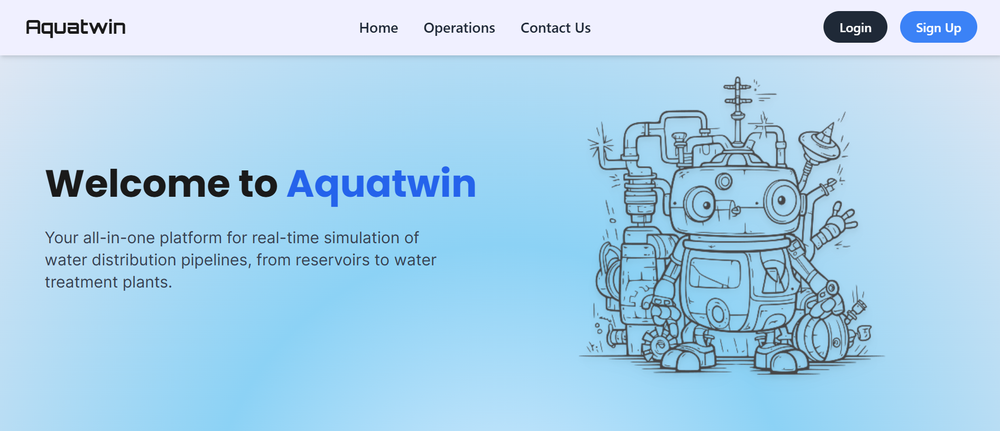
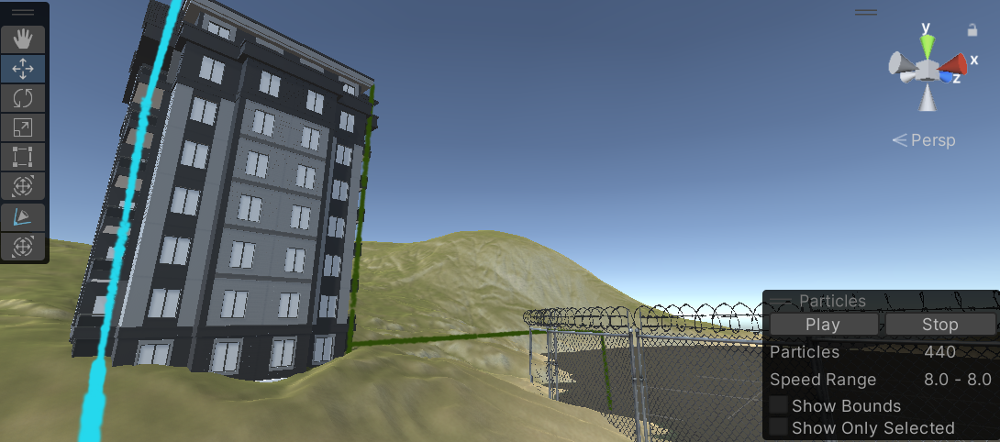
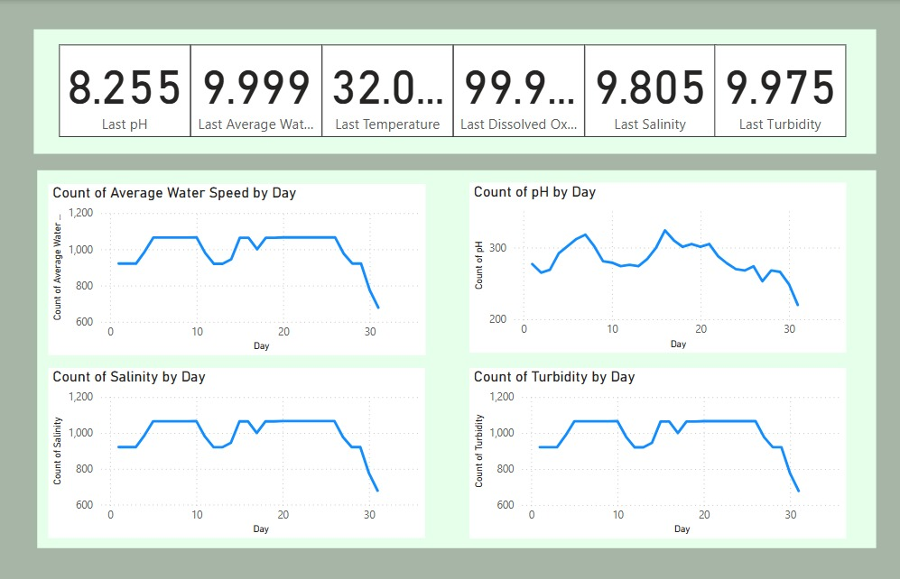
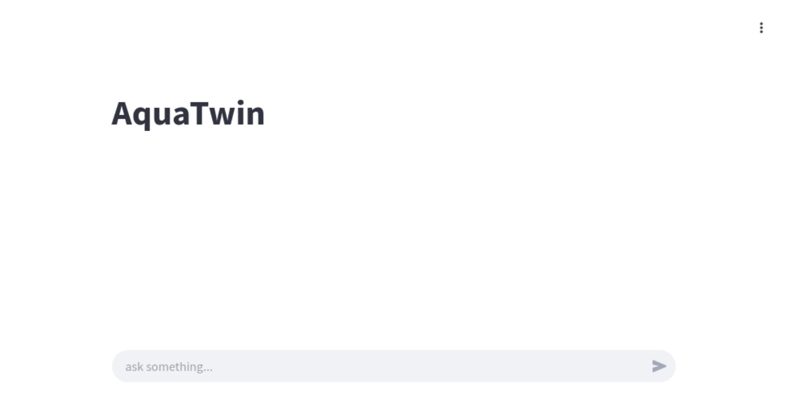

# AquaTwin


&#x20; &#x20;
A 3D Digital Twin for Smart Water Management

AquaTwin is an intelligent digital twin system designed to simulate, monitor, and optimize smart water infrastructure. Leveraging Unity for real-time 3D visualization, LangChain-powered LLM agents for decision support, and a full-stack dashboard for system insights, AquaTwin provides a powerful tool for water resource management.

> 📦 **[Original Repository (Archived)](https://github.com/SonitBahl/Yantra-Central-Web)** — this repo has been restructured and updated.
---

## 🚀 Features

- **3D Digital Twin** built in **Unity**

  - Particle-based water flow visualization
  - Parameterized simulations
  - Real-time rendering using **TextMeshPro**

- **AI-Driven Simulation Control**

  - LLM agent (LangChain-based) to:
    - Trigger simulations
    - Analyze system behavior
    - Compare historical performance
    - Recommend optimal control actions

- **Full-Stack Dashboard**

  - Developed in **React.js**
  - **MongoDB** for configuration and data logging
  - Embedded **Power BI** for live analytics and alerting

---

## 📁 Repository Structure

```
AquaTwin/
├── AquaTwin_Backend        # Node.js backend with MongoDB connection
├── AquaTwin_Frontend       # React.js dashboard with Power BI integration
├── AquaTwin_LangGraph      # LangChain-based logic for intelligent simulation control
└── AquaTwin_Simulation     # Unity project with 3D models, flow control, and UI
```

---

## 💡 Use Cases

- Smart city water management
- Water treatment plant monitoring
- Historical performance tracking
- Real-time anomaly detection and alerts

---

## 📸 Preview

<table align="center">
  <tr>
    <td></td>
    <td></td>
  </tr>
  <tr>
    <td></td>
    <td></td>
  </tr>
</table>


---

## 🛠️ Tech Stack

- **Unity**, **C#**
- **Python**, **LangChain**
- **React.js**, **MongoDB**
- **Power BI**

---
## 📝 License

This project is licensed under the [MIT License](./LICENSE).

---

## 👥 Contributors

<table>
  <tr>
    <td align="center">
      <a href="https://github.com/SonitBahl">
        
        <br>
        <sub><b>Sonit Bahl</b></sub>
      </a>
    </td>
    <td align="center">
      <a href="https://github.com/rogue-socket">
        
        <br>
        <sub><b>Yash Agrawal</b></sub>
      </a>
    </td>
    <td align="center">
      <a href="https://github.com/RAINAVINAYAK16">
        
        <br>
        <sub><b>Vinayak Raina</b></sub>
      </a>
    </td>
    <td align="center">
      <a href="https://github.com/Avijit-D">
        
        <br>
        <sub><b>Avijit Dhangar</b></sub>
      </a>
    </td>
    <td align="center">
      <a href="https://github.com/aishwaryapvt">
        
        <br>
        <sub><b>Aishwarya S</b></sub>
      </a>
    </td>
  </tr>
</table>